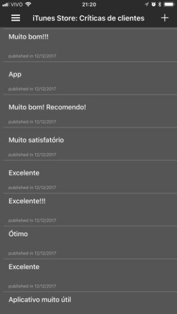
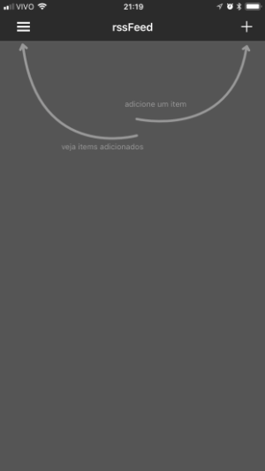

# rssReader

An iOS rss Reader writed in Swift.

## Instalation

Clone project and run `pod install`.

## Features

- Add a new URL
- List all
- View List with title, description, image and date
- Peek&Pop to view post details
- Memory cache between rss lists

## Screenshots

 

